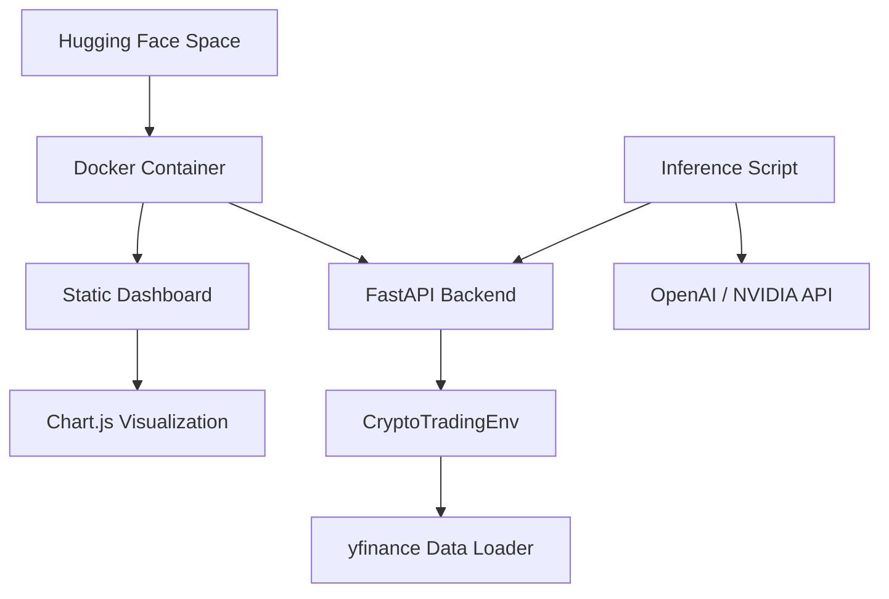

# Cryptocurrency Trading Environment (OpenEnv)

A complete, real-world reinforcement learning environment for multi-asset cryptocurrency trading, developed for the **OpenEnv Hackathon (Round 1)**.

## 🚀 Overview & Motivation
In financial markets, making sequential decisions under uncertainty is a core challenge. This environment models a professional trading task: managing a portfolio of multiple cryptocurrencies (BTC, ETH, BNB, XRP, LTC) using high-frequency (5-minute) candle data. 

### **Key Features**
- 💎 **Premium Glassmorphic UI**: High-fidelity dashboard for real-time monitoring.
- 📉 **Interactive Analytics**: Time-series charts for balance, rewards, and action distribution.
- ⚡ **Multi-Asset RL**: Native support for position sizing across 5 non-correlated assets.
- ⚙️ **Dockerized Deployment**: Fully containerized and ready for Hugging Face Spaces.
- 🏗️ **OpenEnv Compliant**: Strictly follows standard Gymnasium and OpenEnv interfaces.

---

## 🏗 Architecture
This project follows a modern, full-stack RL architecture:



---

## 🛠 Action & Observation Spaces

### **Action Space (MultiDiscrete)**
For each of the assets, the agent chooses an action from **0-8**:
- **0**: Hold (No change)
- **1-4**: Buy (25%, 50%, 75%, or 100% of available USD balance)
- **5-8**: Sell (25%, 50%, 75%, or 100% of current asset holdings)

### **Observation Space (Box)**
A vector representing the current market state and portfolio:
- **Historical Data**: Last $N$ periods of OHLCV data for all assets.
- **Portfolio State**: 
    - Current USD Balance.
    - Current holdings (amount) for each asset.
    - Total Portfolio Value.

---

## 🏆 Tasks & Difficulty
The environment follows the OpenEnv specification with three distinct task levels defined in `openenv.yaml`:

| Task ID | Name | Difficulty | Assets | Goal |
| :--- | :--- | :--- | :--- | :--- |
| `crypto_trading_basic` | Basic Trading | **Easy** | 2 | Achieve 10% return in 100 steps. |
| `crypto_trading_intermediate` | Intermediate | **Medium** | 3 | Achieve 25% return in 200 steps (Risk-adjusted). |
| `crypto_trading_advanced` | Advanced | **Hard** | 5 | Achieve 50% return in 300 steps (Efficiency bias). |

---

## 📊 Baseline Scores
Verified baseline scores using the random strategy in `inference.py`:
- **Average Return (100 steps)**: ~2.1% - 3.5%
- **Success Rate (Easy)**: ~15% (Random baseline)

The environment is designed to be challenging for LLM agents, requiring them to parse price trends and manage balances effectively.

---

## 💻 Setup & Usage

### **Local Execution (Docker)**
```bash
# Build the container
docker build -t crypto-trading-env .

# Run the server
docker run -p 7860:7860 crypto-trading-env
```

### **Running Baseline Inference**
Ensure the following environment variables are set:
- `OPENAI_API_KEY`: Your NVIDIA/OpenAI API key.
- `API_BASE_URL`: NVIDIA endpoint (`https://integrate.api.nvidia.com/v1`).
- `MODEL_NAME`: `nvidia/nemotron-3-super-120b-a12b`.

```bash
python inference.py
```

---

## 📂 Project Structure
```text
├── crypto_trading_env/     # Core RL Environment logic (Gymnasium)
├── static/                 # Frontend dashboard assets (HTML/CSS/JS)
├── server/                 # FastAPI backend & Simulation API
├── openenv.yaml            # Hackathon task definitions and rubrics
├── inference.py            # LLM-based agent baseline script
├── Dockerfile              # Container configuration for HF Spaces
└── pyproject.toml          # Project dependencies (uv-compatible)
```

---

## 🌐 Dashboard
The Space includes a built-in dashboard for visual validation:
- **Live Health Monitoring**: Check system status.
- **Simulation Toolkit**: Trigger 100-step simulations directly in the browser.
- **Interactive Charts**: Powered by Chart.js to visualize balance, rewards, and action distribution.

---

Created by **OpenEnv Hackathon Participant** | Built with OpenEnv-Core & FastAPI.
